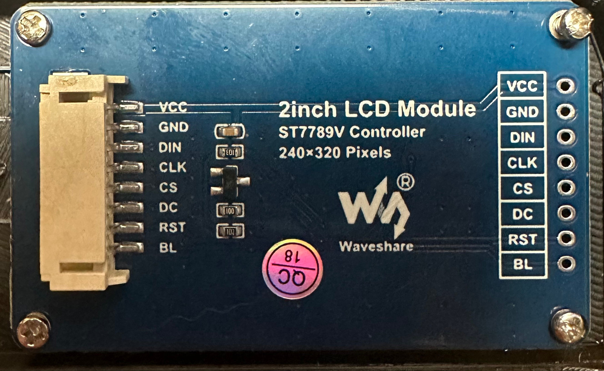
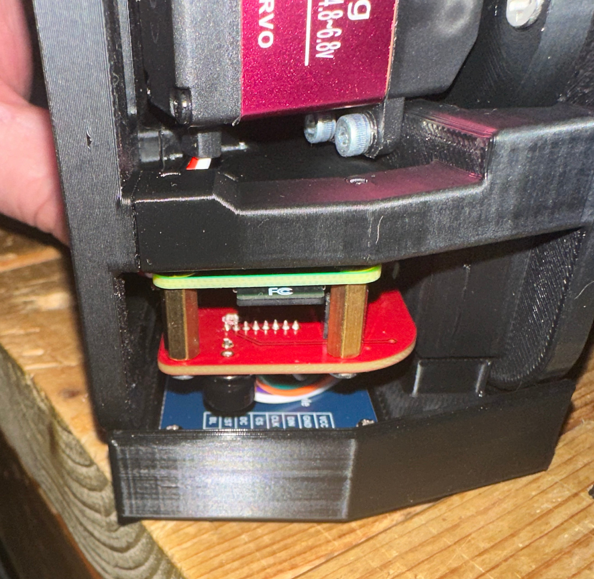
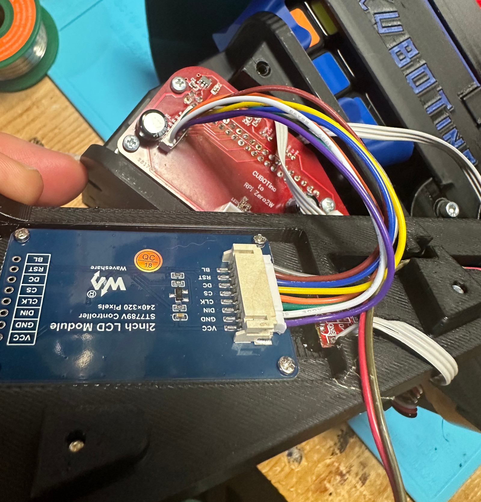

# Waveshare 1.8 and 2 inch displays

- Both are fully compatable with the current version of cubotino.
- The [Waveshare 1.8inch](https://www.waveshare.com/product/displays/lcd-oled/lcd-oled-3/1.8inch-lcd-module.htm) display is a 160x128 ST7735 based display.
- The [Waveshare 2.0inch](https://www.waveshare.com/product/displays/lcd-oled/lcd-oled-3/2inch-lcd-module.htm) display is a 320x240 ST7789 based display.
- The STL files to print are attached for the USB-C Power input variants.
- The 1.8in display mounts to the PCB_Cover with 2.5mm screws, They are included with the screen
- The 2in display  mounts to the PCB_Cover with 2.0mm screws, They are included with the screen

# Wiring
- The connector on the back of the display is a [JST PH](https://www.jst.com/products/crimp-style-connectors-wire-to-board-type/ph-connector/) series connector.
- These displays come with a cable to connect the display to your PCB. Or they can be soldered. The cable provided has 
individual leads with dupont connectors. 
- Using the [Cubotino Schematic](/connections_board/info/Schematic_Cubotino.pdf), the table below is used to connect the wires.

| Connections PCB Pin order | PCB Pin name | Waveshare Pin name | Waveshare Pin order |
|--------------|--------------------|------------|----------------------|
| 1 | GND | GND | 2 |
| 2 | +3.3 | VCC | 1 |
| 3 | SCLK | CLK | 4 |
| 4 | MOSI | DIN | 3 |
| 5 | GP22 | RST | 7 |
| 6 | GP27 | DC | 6 |
| 7 | CS0 | CS | 5 |
| 8 | GP4 | BL | 8 |

# Assembly
- Here is a couple of pictures of my assembly.  Note: While I used a custom PCB. It is based on the [PCB Schematic](/connections_board/info/Schematic_Cubotino.pdf) in this project.
- There is about 20mm between the connections pCP and the Display.

